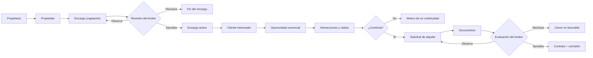

# ControlLocal · BROX

Sistema de gestión y trazabilidad de la operación inmobiliaria: propiedades, encargos,
propietarios, clientes, visitas, expedientes, contratos y comisiones.

En el repositorio el proyecto se llama **ControlLocal**; el producto se llama **BROX**
(SIVAN Solutions). Los documentos nuevos usan el segundo nombre.

El problema que resuelve: cuando la información de una operación vive repartida entre
Excel, WhatsApp y correos, nadie sabe cuál es la versión vigente, quién obtuvo cada dato
ni qué decisión sigue pendiente. Aquí cada hecho queda conectado, fechado y atribuido.

**La distinción que ordena el modelo**: la **propiedad** es el activo físico; el
**encargo** es una operación comercial concreta sobre ese activo. Por eso una misma
propiedad puede tener a la vez un encargo de venta y uno de alquiler, cada uno con su
precio, su vigencia y su histórico, sin mezclarlos.

## Cómo levantarlo

Necesitas **JDK 21+**, **Docker** y **Node 20.19+** (el que exige Angular 20; en esta máquina
corre sobre 24).

```bash
mvn -f backend-spring/pom.xml clean install
```

```bash
docker compose -f backend-spring/docker-compose.yml up -d
```

```bash
npm --prefix frontend-angular start
```

| Servicio | Dónde |
|---|---|
| API | `http://localhost:8090/controllocal/Api` |
| Swagger UI | `http://localhost:8090/controllocal/Api/swagger-ui.html` |
| SPA | `http://localhost:4200` |
| PostgreSQL/PostGIS | `localhost:5433`, base `controllocal_dev` |

Credenciales del seed, **publicadas a propósito** (el arranque en `prod` se detiene si
alguna sigue viva): `admin@controllocal.test`/`Admin2026`, `rsalas`…`sramirez`/`Broker2026`,
`vmora`…`rgomez`/`Agente2026`.

> El `JAVA_HOME` por defecto de la máquina de desarrollo apunta a un JDK 17 y rompe la
> compilación (`release=21`). Exporta un JDK 21+ antes de compilar.

## El flujo comercial



`OportunidadComercial` es la entidad bisagra: conserva la trazabilidad aunque el
interesado nunca llegue a presentar una solicitud formal.

**Alcance real, sin adornos**: el expediente formal está construido de punta a punta para
**alquiler**. Venta tiene modelo, encargo y publicación, pero todavía no un cierre
equivalente. La propiedad admite **siete tipos** (local, oficina, departamento, casa,
terreno, almacén, otro) y la profundidad del catálogo no es igual en todos.

## Quién hace qué

| Banda | Responsabilidad | No puede |
|---|---|---|
| `TENANT_ADMIN` | Gobierna la organización: cuentas, organigrama, invitaciones | **No firma hechos del negocio**: ni aprueba encargos, ni conforma documentos, ni evalúa solicitudes |
| `BROKER` | Supervisa y **decide**: revisa encargos, evalúa solicitudes, rescinde contratos | No crea ni edita agentes, no invita |
| `AGENTE` | **Registra y opera**: propiedades, encargos, clientes, oportunidades, visitas, solicitudes | No aprueba su propio trabajo |

La regla de fondo es que *gobernar no es operar* y *el broker decide, el agente registra*.
Quién puede llamar a qué —y **dónde se decide el alcance**— está en
[`docs/ai/matriz-operacion-rol.md`](docs/ai/matriz-operacion-rol.md), que **rompe el build**
si se desvía del código: un endpoint nuevo necesita su fila.

## El repositorio

| Carpeta | Qué es |
|---|---|
| [`backend-spring/`](backend-spring/) | La API. Reactor Maven de cinco módulos sobre Spring Boot 3.5 + PostgreSQL/PostGIS. [README](backend-spring/README.md) |
| [`frontend-angular/`](frontend-angular/) | La SPA. Angular 20, standalone + signals. [README](frontend-angular/README.md) |
| [`kairos-service/`](kairos-service/) | Prototipo de asistente conversacional sobre la API. Proyecto aparte. [README](kairos-service/README.md) |

El esquema lo posee **Flyway** (`backend-spring/controllocal-app/src/main/resources/db/migration/`).
No hay scripts sueltos que ejecutar y **una migración aplicada no se edita nunca**.

## Convenciones

- **El vocabulario del dominio es español** —entidades, enums, métodos y comentarios—.
  Si añades código, mantenlo en español.
- Conventional Commits: `feat:`, `fix:`, `docs:`, `refactor:`, `chore:`.
- **Nada de credenciales versionadas.** La configuración va por variables de entorno según
  el perfil de Spring; en `prod` no hay valores por defecto y el arranque se detiene
  nombrando la variable que falte.
