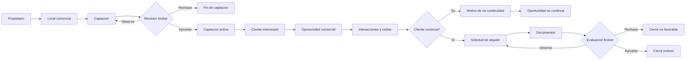

# ControlLocal

ControlLocal es un sistema para gestionar, controlar y auditar el proceso comercial de alquiler de locales comerciales en una corredora inmobiliaria.

El proyecto busca resolver tres problemas frecuentes del corretaje:

- Informacion repartida entre Excel, llamadas, WhatsApp y correos.
- Poca trazabilidad sobre quien hizo cada accion y por que cambio un estado.
- Dificultad para supervisar captaciones, visitas, solicitudes y cierres.

La idea central es sencilla: cada operacion comercial debe quedar conectada desde el propietario y el local hasta la oportunidad, la visita, la solicitud, la evaluacion y el cierre.

## Guia Rapida

| Necesitas... | Lee... |
| --- | --- |
| Levantar backend, frontend y probar credenciales | [Como Probar](#como-probar) |
| Crear o recrear la base de datos | Scripts SQL en [`database/`](database/) |
| Entender entidades, atributos y enums | [Modelo De Dominio](#modelo-de-dominio) y [`database/01_create_schema_controllocal.sql`](database/01_create_schema_controllocal.sql) |
| Entender roles, permisos y sesion | [Roles](#roles) |
| Entender el flujo comercial completo | [Flujo Principal](#flujo-principal) |

## Alcance Funcional

ControlLocal cubre el ciclo operativo de alquiler comercial:

1. Registro de propietarios.
2. Registro de locales comerciales.
3. Captacion del local por un agente inmobiliario.
4. Revision de la captacion por broker.
5. Registro de clientes interesados.
6. Creacion de oportunidades comerciales.
7. Seguimiento mediante interacciones y visitas.
8. Solicitud formal de alquiler.
9. Carga y revision de documentos.
10. Evaluacion de la solicitud.
11. Contrato, comision, reportes, tareas, alertas e historial.

## Arquitectura

El repositorio combina un backend Java por capas, una API Jakarta REST, una base MySQL y un frontend Blazor.

```text
ControlLocal/
|
|-- backend-java/
|   |-- controllocal-model/       Entidades y enums del dominio.
|   |-- controllocal-db-manager/  Conexion JDBC y configuracion de BD.
|   |-- controllocal-dao/         Persistencia JDBC.
|   |-- controllocal-bl/          Reglas de negocio.
|   |-- controllocal-rest/        API Jakarta REST desplegable como WAR.
|   `-- controllocal-app/         Entrada Java auxiliar.
|
|-- frontend-csharp/
|   `-- ControlLocal.Web/         Frontend Blazor.
|
|-- database/                     Scripts SQL, seeds y diagramas.
`-- docs/                         Diagramas e imagenes del proceso y logo.
```

### Responsabilidad Por Capa

| Capa | Que contiene | Por que existe |
| --- | --- | --- |
| `model` | Entidades, enums y objetos de dominio | Define el vocabulario comun del negocio. |
| `db-manager` | Configuracion y apertura de conexiones JDBC | Centraliza el acceso a MySQL sin mezclarlo con reglas de negocio. |
| `dao` | Consultas, inserts, updates y mapeo SQL | Aisla la persistencia para que la capa de negocio no dependa de SQL directo. |
| `bl` | Validaciones, transiciones de estado y reglas | Evita que la API o la UI decidan reglas criticas por su cuenta. |
| `rest` | Endpoints HTTP/JSON, autenticacion JWT y filtros | Expone el dominio al frontend y a pruebas externas. |
| `frontend-csharp` | Pantallas Blazor, navegacion por rol y consumo del API | Permite operar el proceso desde una interfaz web. |
| `database` | DDL, seeds, datos demo y diagrama | Hace reproducible el esquema y los escenarios de prueba. |

## Flujo Principal



La entidad que une casi todo el proceso comercial es `OportunidadComercial`: permite conservar trazabilidad aunque el cliente nunca llegue a presentar una solicitud formal.

## Roles

| Rol | Responsabilidad principal | Puede hacer |
| --- | --- | --- |
| Broker administrador | Gobierno global del sistema | Gestionar brokers, auditar, reasignar agentes y ver reportes globales. |
| Broker supervisor | Supervision de su equipo | Registrar agentes propios, revisar captaciones, reasignar captaciones y evaluar solicitudes de sus agentes. |
| Agente inmobiliario | Operacion comercial diaria | Registrar propietarios, locales, captaciones, clientes, oportunidades, visitas, solicitudes y documentos. |

Regla clave: el broker supervisa y decide; el agente registra y opera. Separar esas funciones da trazabilidad y evita que una misma persona registre y apruebe sin control.

## Modelo De Dominio

Las entidades existen para responder preguntas operativas concretas:

| Pregunta de negocio | Entidades que la responden |
| --- | --- |
| Quien participa? | `Persona`, `UsuarioInterno`, `Broker`, `AgenteInmobiliario`, `Propietario`, `ClienteInteresado`. |
| Que inmueble se ofrece? | `Distrito`, `LocalComercial`, `PrecioLocal`, `Publicacion`. |
| Como se capta y supervisa? | `Captacion`, `Prospeccion`, `ReasignacionCaptacion`, `BrokerAgente`, `ReasignacionAgenteBroker`. |
| Como avanza el interesado? | `OportunidadComercial`, `InteraccionComercial`, `Visita`, `MotivoNoContinuidad`. |
| Cuando se formaliza? | `SolicitudAlquiler`, `DocumentoSolicitud`, `TipoDocumentoRequerido`, `EvaluacionSolicitud`. |
| Como se cierra y controla? | `ContratoAlquiler`, `ComisionLiquidacion`, `ReportePropietario`, `Tarea`, `Alerta`, `HistorialEstado`. |

El sustento detallado de cada entidad, sus atributos y sus enums esta en el esquema [`database/01_create_schema_controllocal.sql`](database/01_create_schema_controllocal.sql).

## API Y Frontend

La API corre bajo:

```text
http://localhost:8080/controllocal/Api
```

Endpoints publicos principales:

- `GET /salud`
- `POST /auth/login`

Modulos REST principales:

- `/propietarios`
- `/locales`
- `/captaciones`
- `/clientes`
- `/oportunidades`
- `/visitas`
- `/solicitudes`
- `/evaluaciones`
- `/alertas`
- `/agentes`
- `/prospecciones`

El frontend Blazor se ejecuta por defecto en:

```text
http://localhost:5232/login
```

## Como Probar

El procedimiento es:

1. Preparar MySQL con los scripts de `database/`.
2. Crear archivos privados de configuracion desde los `.example`.
3. Compilar backend Java con Maven.
4. Desplegar `controllocal-rest` en GlassFish.
5. Ejecutar el frontend Blazor.
6. Iniciar sesion con los usuarios demo del seed.
7. Validar un flujo minimo: captacion, oportunidad, visita, solicitud y evaluacion.

## Configuracion Privada

No se deben versionar credenciales. Los archivos privados esperados son:

```text
backend-java/controllocal-rest/src/main/resources/api.properties
backend-java/controllocal-rest/src/main/resources/aws.properties
backend-java/controllocal-db-manager/src/main/resources/db.properties
frontend-csharp/ControlLocal.Web/appsettings.json
```

Usa como base:

```text
backend-java/controllocal-rest/src/main/resources/api.properties.example
backend-java/controllocal-rest/src/main/resources/aws.properties.example
backend-java/controllocal-db-manager/src/main/resources/db.properties.example
frontend-csharp/ControlLocal.Web/appsettings.example.json
```

## Convenciones

Este proyecto usa Conventional Commits:

- `feat:` nueva funcionalidad.
- `fix:` correccion de errores.
- `docs:` documentacion.
- `refactor:` mejora interna sin cambiar comportamiento.
- `chore:` mantenimiento.

Para documentacion, prioriza claridad operativa: que una persona pueda entender que hace el sistema, por que existe cada pieza y como probarla sin pedir contexto adicional.
