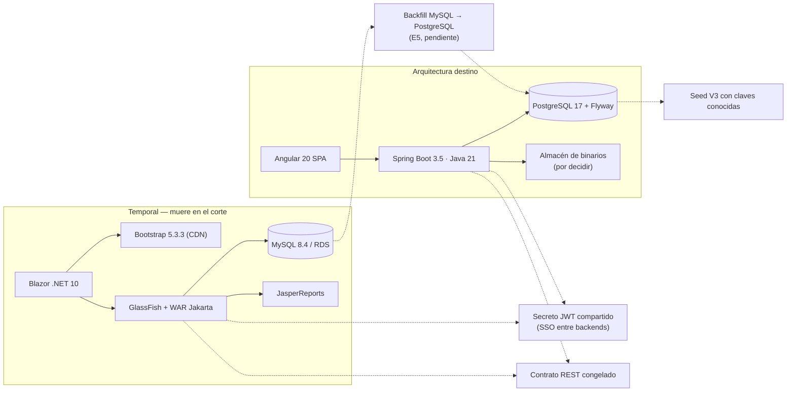

# Informe técnico — tecnologías, dependencias y alcance corregido de E5

**Fecha:** 2026-08-04 · **Naturaleza:** inventario **de solo lectura**. No se cambió ningún proveedor,
dependencia ni configuración.
**Restricción del encargo:** no se selecciona AWS, SES ni ningún proveedor comercial. Las opciones se
comparan priorizando **gratuito / open source / autohospedable**, y la selección queda pendiente de
conocer el entorno de despliegue.

**Los hechos comprobados están en §1–§6. La recomendación técnica está aislada en §8** y se puede
descartar sin invalidar el resto.

---

## 1. Infraestructura actual

### 1.1 Inventario

| Componente | Tecnología y versión | Dónde se configura | ¿Definitivo? | Licencia | Dependencias externas | Costo hoy | Costo esperado |
|---|---|---|---|---|---|---|---|
| **Backend nuevo** | Spring Boot **3.5.7** / Java **21**, reactor Maven de 5 módulos | `backend-spring/pom.xml` | **definitivo** | Apache-2.0 | ninguna en runtime | 0 | 0 |
| **Frontend nuevo** | Angular **20.3**, TypeScript 5.9, RxJS 7.8, zone.js | `frontend-angular/package.json` | **definitivo** | MIT | **ninguna**: sin librería de UI, sin CDN, sin gráficos de terceros | 0 | 0 |
| **BD nueva** | PostgreSQL **17-alpine** en contenedor, puerto host 5433 | `backend-spring/docker-compose.yml` | **definitivo** | PostgreSQL License | — | 0 | coste del servidor |
| **Migraciones** | Flyway Core + `flyway-database-postgresql`, **27 migraciones** | `controllocal-app/src/main/resources/db/migration/` | **definitivo** | Apache-2.0 (edición community) | — | 0 | 0 |
| **Contrato API** | springdoc-openapi (Swagger UI) | dependencia de `controllocal-web` | definitivo | Apache-2.0 | — | 0 | 0 |
| **Pruebas backend** | JUnit 5 + Mockito + **ArchUnit** | `spring-boot-starter-test`, `archunit-junit5` | definitivo | EPL/MIT/Apache-2.0 | — | 0 | 0 |
| **Pruebas frontend** | Karma + Jasmine, navegador **Edge** headless | `package.json`, `CHROME_BIN` | definitivo (Karma está en desuso ascendente) | MIT | navegador local | 0 | 0 |
| **Contenedores** | Docker **29.6.2**, Compose **v5.3.1** | `backend-spring/docker-compose.yml` | **definitivo** | Apache-2.0 (Engine) | Docker Desktop en Windows | 0 (Desktop puede requerir licencia comercial según tamaño de empresa) | verificar |
| **Backend legado** | Jakarta REST + JDBC sobre **GlassFish**, WAR, `context-root /controllocal` | `glassfish-web.xml`, `RestApplication` | **temporal** | EPL-2.0/GPL-2.0-CPE | GlassFish, MySQL | 0 | **desaparece** |
| **Reportes legado** | JasperReports (`jasperreports`, `-pdf`, `-fonts`, `-metadata`) | `controllocal-rest/pom.xml` | **temporal, fuera de alcance (D-F5-1)** | LGPL-3.0 | — | 0 | **desaparece** |
| **BD legado** | MySQL **8.4** (contenedor local parado + RDS) | `db.properties` (gitignorado) | **temporal** | GPL-2.0 | RDS si aplica | RDS ≠ 0 | **desaparece** |
| **Frontend legado** | Blazor Server, **.NET 10.0** | `ControlLocal.Web.csproj` | **temporal** | MIT | **Bootstrap 5.3.3 desde CDN jsdelivr** | 0 | **desaparece** |
| **Reverse proxy** | **NO EXISTE** | — | — | — | — | 0 | necesario |
| **CI/CD** | **NO EXISTE**: `.github/workflows/` existe pero está **vacío** | — | — | — | — | 0 | necesario |
| **Secretos** | Variables de entorno **con fallback en código**; `.gitignore` cubre `.env`, `*.properties` sensibles y `appsettings.Local.json` | `application.yml`, `api.properties` | **temporal** (H-01) | — | — | 0 | necesario |
| **Logs** | stdout de Spring Boot por defecto | — | **temporal** | — | — | 0 | necesario |
| **Métricas y alertas** | **NO EXISTEN**. Sin Actuator, sin Micrometer, sin healthcheck de aplicación más allá de `GET /salud` | — | — | — | — | 0 | necesario |
| **Copias de seguridad** | **NO EXISTEN**. Volumen `controllocal_pg_data` sin política ni verificación | `docker-compose.yml` | — | — | — | 0 | **necesario y urgente** |
| **Archivos** | Disco local `./almacen-dev` **dentro del contenedor**, sin volumen | `ALMACEN_DIR`, `AlmacenDisco` | **temporal** | — | — | 0 | necesario |

**Dato que conviene subrayar:** el stack nuevo tiene **cero dependencias de pago y cero servicios
externos**. Todo lo que hoy corre es OSS y autohospedado. La deuda no es de licencias: es de
**operación** (sin CI, sin backups, sin métricas, sin proxy).

### 1.2 Entornos

| Entorno | Estado |
|---|---|
| **Local** | Único que existe. `docker compose up -d` (postgres 5433 + api 8090) + `npm start` (4200). |
| **Pruebas (E2E)** | **Existe y es sofisticado**: `Invoke-E2E.ps1` levanta un **entorno efímero por suite** — proyecto Compose propio, puerto TCP libre, base `controllocal_e2e_<runId>`, contenedores `controllocal-{postgres,api}-e2e-<runId>` y `down -v --remove-orphans` en `finally`. Es lo más cercano a CI que hay. |
| **Staging** | **No existe.** |
| **Producción** | **No existe, y no está decidido dónde vivirá.** Esa decisión bloquea la elección de almacenamiento, correo y secretos. |

### 1.3 Qué pasa con **más de una instancia**

Ejecutado hoy en dos réplicas, el sistema falla de cinco formas distintas. Es la sección más
importante de este inventario porque condiciona todo el diseño de S0:

| Componente | Estado en memoria | Efecto con N instancias | Gravedad |
|---|---|---|---|
| **`AlmacenDisco`** | disco local del contenedor | **Roto**: un archivo subido por la instancia A no existe para B. Y hoy, sin volumen, se pierde al recrear el contenedor. | **Bloqueante** |
| **Buffer de subida por trozos** | mapa en memoria | Una carga partida entre instancias falla. (Deuda ya conocida: el endpoint muere con el Blazor.) | Alta |
| **`LimitadorIntentos`** | contador por proceso | El límite efectivo de login pasa a **10 × N por minuto**. | Alta (seguridad) |
| **`AlertasController.ultimaSyncRecontacto`** | `volatile long` por proceso | El barrido de recontacto corre hasta **N veces cada 5 min** en vez de una. | Media |
| **`OrganizacionServiceImpl.idLegado`** | memoizado por proceso | Inofensivo: el valor es inmutable. | Ninguna |
| **JWT stateless** | — | Escala bien: cualquier instancia valida cualquier token. | Ninguna |
| **Flyway** | — | Correcto: usa lock de base de datos. | Ninguna |
| **`sesiones_invalidas_desde`** (propuesto en S0) | — | **Exige caché coherente o sin caché**: con caché local por instancia, la revocación tarda hasta el TTL en cada réplica. | A tener en cuenta |

---

## 2. Dependencias del legado

### 2.1 Desambiguación de "bootstrap" (los cuatro sentidos)

El término aparece con cuatro significados distintos y **solo dos existen hoy**:

| Sentido | ¿Existe? | Evidencia | Destino |
|---|---|---|---|
| **Framework visual Bootstrap** | **Sí**: `bootstrap@5.3.3` **solo el grid**, cargado desde **CDN jsdelivr** | `frontend-csharp/.../Components/App.razor:12` | **Solo lo usa el Blazor.** El SPA Angular **no lo usa** — su CSS es propio (`styles.scss` + primitivas `cl-*`). Muere con el Blazor. |
| **`bootstrapApplication` de Angular** | Sí | `frontend-angular/src/main.ts` | Es la función de arranque del framework, **no una dependencia externa**. Se queda. |
| **Datos de arranque (seed)** | **Sí**: las 21 cuentas de V3 | `V3__seed_identidad_base.sql` | Se separa del esquema en S0.1. |
| **Credencial de bootstrap** | **NO existe hoy.** `ADMIN_BOOTSTRAP_*` es **una propuesta** del Plan S0, no código actual. | — | Se implementaría en S0.1; es un mecanismo **temporal por diseño**. |

### 2.2 Dependencias vivas del legado

| Dependencia | Por qué sigue | Quién la usa | Qué la reemplaza | Fase en que muere | Prueba que autoriza retirarla |
|---|---|---|---|---|---|
| **GlassFish** | Sirve el WAR de la v1, que sigue siendo el sistema en uso | `backend-java/controllocal-rest` | El fat jar de `controllocal-app` (Tomcat embebido) | **Corte** | El SPA cubre el 100 % de los módulos y E5 cierra por módulo (§6). Tráfico a `:8080` en cero durante una ventana observada. |
| **Backend Jakarta** | Es la implementación de referencia del contrato congelado | Blazor + Postman histórico | `backend-spring` (26/26 recursos ya cortados) | **Corte** | E5 por módulo + los 13 scripts de `verificacion/` en verde. |
| **MySQL 8.4 / RDS** | Es la base de la v1 | `controllocal-db-manager` | PostgreSQL v2 | **Corte** (tras el backfill real, E5) | Backfill ejecutado y conciliado: conteos por tabla y muestreo de identificadores v1↔v2. |
| **Blazor (.NET 10)** | Es la UI en uso hasta el corte | usuarios finales | SPA Angular (47/~52 pantallas) | **Corte** | Las 2 pantallas restantes resueltas o descartadas + E5. |
| **Bootstrap 5.3.3 (CDN)** | Solo lo carga el Blazor | `App.razor` | CSS propio del SPA | **Corte** (con el Blazor) | Ninguna: desaparece al borrar el proyecto. |
| **Contrato JWT compartido** | Habilita el SSO entre backends (mismo formato, mismo secreto) | `TokenService` de ambos | Sesión definitiva de S0.7 (§3) | **Post-corte** | Ninguna instancia de GlassFish activa. |
| **Contrato REST congelado** | La v1 sigue sirviendo a clientes | los 26 recursos | Contrato v2 libre de replicar bugs | **Post-corte** | Decisión explícita de descongelar (paso 8 del checklist). |
| **`es_administrador` + su índice único** | La v1 lo lee para decidir el rol | `detalle_broker` | Rol `ADMIN` real + membresía (Plan S0 §2) | **Corte** (migración V34, ya planificada como diferida) | Ningún código de la v1 en ejecución. |
| **Seed V3 con claves conocidas** | Migración ya aplicada; los 13 scripts E2E la usan | `verificacion/*.ps1` | Seed en location `dev` + bootstrap productivo | **S0.1** (no espera al corte) | Arranque productivo que falla si detecta hashes del seed. |
| **`GET /documentos/contenido` público** | Restricción del visor Blazor | `AlmacenDocumentos` | Descarga autenticada por Blob, **que el SPA ya usa** | **Corte** | Cero peticiones a esa ruta durante una ventana observada. |
| **Endpoints de subida por trozos y base64** | Existen por un bug del cliente .NET | `SolicitudesController` | `octet-stream`, **que el SPA ya usa** | **Corte** | Ídem: cero peticiones. |
| **JasperReports** | Empaquetado en el WAR | `controllocal-rest` | Nada (fuera de alcance, D-F5-1) | **Corte** | — |

**Confirmado por el encargo:** GlassFish, Blazor y los mecanismos temporales de bootstrap **no forman
parte de la arquitectura destino**.

### 2.3 Diagrama de dependencias

Líneas continuas = dependencia de ejecución. Punteadas = acoplamiento por contrato o por datos.
Todo lo del bloque **TEMPORAL** y los tres acoplamientos punteados desaparecen en el corte, salvo el
seed, que se retira antes (S0.1).

---

## 3. Autenticación y seguridad: qué hay, qué falta, qué es compatible

### 3.1 Componentes existentes y ausentes

| Capacidad | Estado hoy | Evidencia |
|---|---|---|
| **Hash de contraseñas** | **Existe**: PBKDF2-HMAC-SHA256, 100 000 iteraciones, sal de 16 B, comparación en tiempo constante. Implementación propia sobre el JDK. | `PasswordHasher.java` |
| **JWT y firma** | **Existe**: HS256 **implementado a mano** con `javax.crypto.Mac`. Sin librería JWT. | `TokenService.java` |
| **Revocación (`sesiones_invalidas_desde`)** | **No existe.** El diseño propuesto (comparar contra `iat`) **es viable sin tocar el token**, porque `iat` ya viaja. | Plan S0 §4.7 |
| **Caché** | **No existe ninguna**: sin Caffeine, sin Redis, sin `@EnableCaching`. Hay dos memoizaciones a mano en campos. | `pom.xml` |
| **MFA / TOTP** | **No existe.** | — |
| **Códigos de recuperación** | **No existe.** | — |
| **Auditoría de accesos** | **No existe.** Solo `historial_estado`, que audita transiciones de negocio. | `V2__auditoria_universal.sql` |
| **Rate limiting** | **Existe, limitado**: `LimitadorIntentos` propio, en memoria, 10/min por IP, solo en login. | `LimitadorIntentos.java` |
| **Gestión de secretos** | **Parcial**: variables de entorno con fallback en código. Sin bóveda, sin rotación. | `application.yml` |
| **Envío de correo** | **No existe**: ninguna dependencia de mail, ninguna configuración SMTP. | `pom.xml`, `application.yml` |
| **Sesiones post-corte** | **No existe.** | — |
| **Protección CSRF** | `csrf.disable()`, **correcto hoy** (el token va en `Authorization`, no en cookie). Deja de serlo si se adoptan cookies. | `ConfiguracionSeguridad:50` |
| **Cifrado de datos sensibles** | **No existe**: ni cifrado de campo, ni TLS en la aplicación (correspondería al proxy, que tampoco existe). | — |

### 3.2 Opciones gratuitas / OSS compatibles con el stack

Sin seleccionar; solo compatibilidad y coste.

| Necesidad | Opción | Licencia | Encaje |
|---|---|---|---|
| **Hash moderno** | `BCryptPasswordEncoder` de Spring Security | Apache-2.0 | **Ya está en el classpath** (`spring-boot-starter-security`): cero dependencias nuevas |
| | `Argon2PasswordEncoder` de Spring Security | Apache-2.0 | Requiere **BouncyCastle** (MIT) como dependencia extra |
| | Mantener PBKDF2 subiendo iteraciones | — | Cero cambios; menos robusto frente a GPU que Argon2id |
| **JWT** | Seguir con la implementación propia | — | Cero dependencias; superficie propia a mantener |
| | Nimbus JOSE+JWT | Apache-2.0 | Estándar de facto; lo arrastra `spring-boot-starter-oauth2-resource-server` |
| | JJWT | Apache-2.0 | API sencilla |
| **Caché** | **Caffeine** | Apache-2.0 | En proceso, cero infraestructura. **Suficiente con una instancia**; con N, cada una tiene su TTL |
| | **Valkey** (fork OSS de Redis) | BSD-3 | Caché **compartida**; resuelve revocación y rate limiting distribuidos. Un contenedor más |
| **MFA / TOTP** | `dev.samstevens.totp` | MIT | Librería pequeña, genera QR |
| | `googleauth` (warrenstrange) | BSD-3 | Alternativa clásica |
| | Implementación propia RFC 6238 | — | ~60 líneas sobre `javax.crypto.Mac`, que **ya se usa** para el JWT |
| **Rate limiting** | **bucket4j** | Apache-2.0 | Token bucket, con backend distribuido opcional |
| | En el proxy (nginx/Caddy/Traefik) | BSD/Apache-2.0 | Protege **antes** de llegar a la aplicación; no distingue por cuenta |
| **Secretos** | Docker/Podman secrets | Apache-2.0 | Suficiente para un despliegue de un nodo; sin rotación |
| | **SOPS + age** | MPL-2.0 / BSD | Secretos **cifrados en el repositorio**, descifrados en el despliegue. Muy bajo coste operativo |
| | **OpenBao** (fork OSS de Vault) | MPL-2.0 | Bóveda completa con rotación. **Nota:** HashiCorp Vault pasó a BUSL; OpenBao es la vía OSS |
| | **Infisical** (autohospedado) | MIT (núcleo) | Interfaz web; más piezas que operar |
| **Auditoría** | Tabla append-only en PostgreSQL | — | **Cero infraestructura nueva**; es lo que propone el Plan S0 |
| | Loki + Promtail | AGPL-3.0 | Para logs, no sustituye a la auditoría transaccional |
| **Métricas** | Spring Boot Actuator + Micrometer + **Prometheus** + Grafana | Apache-2.0 / AGPL-3.0 (Grafana) | Actuator es una dependencia; Prometheus y Grafana, dos contenedores |
| **Cifrado de campo** | `pgcrypto` de PostgreSQL | PostgreSQL License | Extensión estándar; útil para el secreto TOTP |
| | Cifrado en la aplicación (AES-GCM del JDK) | — | La clave pasa a ser un secreto más que gestionar |

---

## 4. Correo transaccional

### 4.1 Qué existe hoy (verificado)

| Elemento | Estado |
|---|---|
| Dominio propio habilitado para envío | **NO consta ninguno** en el repositorio |
| Servidor SMTP | **NO** |
| Cuenta de correo institucional | **NO consta** |
| Proveedor SMTP configurado | **NO**: ninguna propiedad `spring.mail.*`, ninguna dependencia de mail |
| Posibilidad de autohospedar | **Indeterminada**: depende del hosting, que no está decidido |
| Restricciones de red para SMTP | **Indeterminadas** por la misma razón |
| Cola, reintentos, seguimiento de entregas | **NO** |

**Conclusión de hecho: el correo transaccional no existe en ninguna forma.** Los correos de las
personas están en `persona.correo` y se usan como dato de contacto y como identificador de login del
administrador, pero **el sistema nunca ha enviado un mensaje**.

**Consecuencia directa sobre el Plan S0:** la recuperación de acceso por token de un solo uso (§4.3
del plan) **no es implementable hasta resolver esto**. La invitación administrativa y la contraseña
temporal **sí lo son** — se entregan fuera de banda —, así que S0.3 puede avanzar sin correo si se
acepta esa limitación.

### 4.2 Comparación de alternativas

| Opción | Licencia / coste | Límites | Entregabilidad | Complejidad de operación | SPF/DKIM/DMARC | Riesgo de bloqueo | Dependencia | Escalabilidad |
|---|---|---|---|---|---|---|---|---|
| **Sin correo** (contraseña temporal entregada por el administrador) | 0 | No hay autoservicio de recuperación | n/a | **Nula** | n/a | Ninguno | Ninguna | n/a |
| **Postfix como relay** (contenedor) | Gratis, IBM Public License | Ninguno técnico | **Baja sin reputación de IP**: los grandes proveedores marcan spam o rechazan | Media: TLS, colas, monitoreo de rebotes | **Hay que configurar los tres** en el DNS del dominio | **Alto** con IP nueva o de rango residencial/cloud | Ninguna | Buena, pero la reputación es el cuello de botella |
| **docker-mailserver / Mailu / Maddy** (servidor completo) | Gratis, MIT/Apache-2.0/GPL-3.0 | — | Misma limitación de reputación | **Alta**: es operar un servidor de correo (antispam, certificados, rebotes, listas negras) | Ídem | **Alto** | Ninguna | Media |
| **Relay SMTP de terceros con capa gratuita** | 0 hasta un tope | Cuota diaria/mensual | **Alta**: IP con reputación gestionada | **Baja**: credenciales SMTP y poco más | El proveedor guía y en parte gestiona DKIM | Bajo | **Sí, del proveedor** | Alta |
| **Servidor SMTP institucional existente** (si la corredora ya tiene correo corporativo) | Ya pagado | Cuota de la cuenta | Alta (dominio con reputación) | **Baja**: usar la cuenta como relay autenticado | Ya configurados para el dominio | Bajo | Del proveedor de correo ya contratado | Media |
| **Mailpit / MailHog** (solo desarrollo) | Gratis, MIT | No envía al exterior | n/a | Nula: un contenedor | n/a | Ninguno | Ninguna | n/a |

**Dos hechos que conviene tener presentes al decidir:**

1. **La entregabilidad no depende del software sino de la reputación de la IP y del dominio.** Un
   Postfix impecable con IP nueva entrega peor que un relay gestionado. Y **la mayoría de los
   proveedores de nube bloquean el puerto 25 de salida por defecto**, lo que suele obligar a usar 587
   contra un relay igualmente.
2. **Los tres registros DNS (SPF, DKIM, DMARC) son obligatorios en cualquier opción** que envíe con
   dominio propio, incluidas las gratuitas. Sin ellos, el correo de recuperación acaba en spam — que
   para un correo de recuperación equivale a no existir.

---

## 5. Almacenamiento de archivos

### 5.1 Estado del código (verificado)

**Stack nuevo — `backend-spring/controllocal-web/.../almacen/`:**

| Pieza | Qué es |
|---|---|
| `AlmacenDocumentos` | **Interfaz** con cuatro operaciones: `proveedor()`, `guardar()`, `abrir()`, `eliminar()` |
| `AlmacenDisco` | **Única implementación**. Raíz configurable (`controllocal.almacen.directorio`, por defecto `./almacen-dev`) |
| `NombresArchivo`, `AlmacenException` | saneado de nombres y error propio |

- **Clave** = ruta relativa `carpeta/<uuid8>-<nombre saneado>`; es la *capability* opaca del contrato.
- **Carpetas reales en uso**: `locales/…` (fotos), `perfiles` (foto de perfil) y el **código de la
  solicitud** —`SOL-…`, o `SOL-{id}` si falta— para el expediente documental.
- **Tipos guardados hoy**: **fotos** de locales, **foto de perfil** y **documentos** del expediente.
  **No hay audios ni otros tipos**; nada en el código los contempla.
- **Descarga**: `GET /documentos/contenido?clave=` — **público** por la restricción del visor Blazor.
  El SPA **no lo usa**: descarga con `Authorization` y `responseType: 'blob'`.
- **Reemplazo / eliminación**: no hay "reemplazar"; se guarda uno nuevo y se elimina el anterior.
  `eliminar()` es **best-effort** (tolera huérfanos a propósito). Tres puntos de llamada.
- **Aislamiento por organización: NO EXISTE en el almacén.** Ninguna clase de `almacen/` menciona la
  organización; la clave **no lleva tenant**. El aislamiento se apoya en (a) que la clave es opaca y
  (b) que el registro en BD sí está filtrado. **Dos organizaciones comparten el árbol de directorios.**
- **Límites**: **5 MB** en tres controladores (`LocalesController`, `PerfilController`,
  `SolicitudesController`) y otros 5 MB validados en el SPA.
- **Copias de seguridad**: **ninguna**. Y algo más grave: **el compose no monta volumen para
  `./almacen-dev`**, así que los binarios viven en la capa de escritura del contenedor y **se pierden
  al recrearlo**.
- **Varias instancias**: **no funciona** (§1.3).

**Stack legado — `backend-java/.../rest/almacen/`** (lo que el encargo pedía revisar):

| Pieza | Qué es |
|---|---|
| `AlmacenDocumentos` | misma interfaz conceptual |
| `AlmacenLocal` | disco |
| `AlmacenS3` + `S3SigV4Cliente` | **cliente S3 escrito a mano**, firma **SigV4** con `java.net.http.HttpClient`, **sin AWS SDK** |
| `Almacenes` | selector `LOCAL` / `S3` / `AUTO` (S3 si responde, si no disco) |
| `AwsConfig` | lee `aws.properties` (gitignorado) |

**Hallazgo relevante para la decisión:** el sistema **ya tiene código propio de firma S3 y no depende
de ningún SDK comercial**. Pero `S3SigV4Cliente` **construye el host como
`bucket.s3.<region>.amazonaws.com`** (línea 67), es decir **virtual-hosted contra AWS**. Para apuntar a
un servidor S3-compatible autohospedado haría falta **endpoint configurable y direccionamiento
path-style**: la firma es reutilizable, la resolución de endpoint no.

### 5.2 Opciones gratuitas / OSS

| Opción | Licencia | Coste operativo | Multi-instancia | Aislamiento por tenant | Copias de seguridad | Observaciones |
|---|---|---|---|---|---|---|
| **Disco local con volumen** | — | **Mínimo** | **No** (salvo con almacenamiento de red compartido) | Por prefijo de clave (hay que añadirlo) | `tar`/`rsync` + verificación de restauración | Es lo que hay hoy, **al que le falta el volumen** |
| **Disco compartido (NFS/SMB)** | — | Bajo-medio | Sí | Ídem | Ídem | Añade un punto de fallo y latencia |
| **MinIO** | **AGPL-3.0** | Medio: un servicio más | Sí | Bucket o prefijo por organización | Replicación + versionado | API S3 muy compatible. **Verificar la licencia y los términos vigentes antes de adoptarlo**: AGPL tiene implicaciones si el producto se distribuye |
| **SeaweedFS** | **Apache-2.0** | Medio | Sí | Prefijo/bucket | Replicación | Licencia **permisiva**; puerta S3 compatible |
| **Garage** | AGPL-3.0 | Bajo-medio | Sí | Bucket | Replicación entre nodos | Pensado para autohospedaje pequeño |
| **Ceph RGW** | LGPL-2.1 | **Alto** | Sí | Sí | Sí | Sobredimensionado para este tamaño |

**Nota de método:** las licencias anteriores son las de conocimiento general del sector y **deben
verificarse contra la versión concreta que se vaya a desplegar** antes de comprometerlas. La
diferencia AGPL vs Apache-2.0 es la que más pesa si ControlLocal llega a distribuirse como producto
—que es justamente el North Star del proyecto—.

**No se selecciona ninguna**: la elección depende del entorno de despliegue (un nodo o varios), que
no está decidido.

---

## 6. Alcance corregido de E5

### 6.1 El error de la definición anterior

E5 se describía como *"paridad módulo a módulo"*. Tomado literalmente, eso **convierte cada mejora en
un fallo**: la paginación en base de datos "no coincide" con descargar todo y recortar en el cliente;
una pantalla real "no coincide" con una maqueta. **La paridad de comportamiento observable ya no es
el criterio correcto**, y además dejó de ser 1:1 el día que D-F5-1 retiró cinco endpoints.

**Definición corregida:** *E5 valida que **el negocio queda cubierto y correcto**, no que el sistema
nuevo reproduzca al viejo.*

### 6.2 Qué se valida, por módulo

Los **doce ejes**, con la evidencia que hace verificable cada uno:

| # | Eje | Cómo se comprueba |
|---|---|---|
| 1 | **Cobertura del proceso** | Recorrido completo del módulo de punta a punta, con datos reales |
| 2 | **Reglas e invariantes** | Precondiciones y postcondiciones enumeradas; una prueba por invariante |
| 3 | **Datos visibles y modificables** | Campo por campo: qué se muestra, qué se puede editar, qué se ignora al guardar |
| 4 | **Operaciones por rol y alcance** | Contraste contra `matriz-operacion-rol.md` (que ya está cubierta por test) |
| 5 | **Navegación necesaria** | Toda ruta alcanzable desde el menú o desde una ficha; sin callejones sin salida |
| 6 | **Estados y transiciones** | Contraste contra `matriz-codigos-estado.md`; transiciones prohibidas rechazadas |
| 7 | **Auditoría** | Cada transición sensible deja fila en `historial_estado` con actor y motivo |
| 8 | **Aislamiento por tenant** | Un id de otra organización responde 404 en cada endpoint del módulo |
| 9 | **Manejo de errores relevantes** | Los 4xx que el usuario puede provocar están explicados en pantalla, no en crudo |
| 10 | **Rendimiento** | RC-003 (< 3 s) sobre el volumen del gate del módulo |
| 11 | **Integridad de datos** | El backfill v1→v2 conserva conteos y relaciones; muestreo de identificadores |
| 12 | **Regresiones sobre mejoras aprobadas** | Ninguna de las mejoras de §6.4 se ha perdido |

### 6.3 Clasificación obligatoria de cada diferencia

Ninguna diferencia se registra como "difiere" a secas. Cada una entra en **una** de estas seis
categorías, y solo la primera abre un defecto:

| Categoría | Qué significa | Acción |
|---|---|---|
| **Regresión** | El sistema nuevo hace **menos o peor** algo que el negocio necesita | **Defecto: se corrige antes del corte** |
| **Mejora aprobada** | El nuevo es más correcto, seguro o eficiente (§6.4) | Se **conserva** y se documenta |
| **Cambio deliberado** | Divergencia decidida y escrita (D-F4-5, D-F5-1, estado real del contrato…) | Se **conserva**; se verifica que la decisión está escrita |
| **Función nueva** | No existía en la v1 (ficha de agente, cartera por inmueble, RF-017, campana) | Se **conserva**; entra en el alcance de pruebas |
| **Comportamiento legado a eliminar** | Bug replicado a propósito o superficie que solo existía por el Blazor | Se **retira** en el paso 8, después del corte |
| **Compatibilidad temporal pendiente** | Existe solo mientras viva el legado (token compartido, `es_administrador`, subidas por trozos) | Se **retira** con su fase, con la prueba de §2.2 |

### 6.4 Mejoras que se conservan y **no** son regresiones

Se declaran aquí para que ninguna revisión las trate como desviación:

**Rendimiento y corrección de datos**

1. Paginación **ejecutada en la base**, no en memoria.
2. Alcance dentro del `WHERE`, nunca filtrado después.
3. `listarTodos` **eliminado** de las rutas calientes.
4. Búsqueda por **ramas indexables + `UNION`** (conjunto de candidatos).
5. **Conteo, página y KPI sobre el mismo conjunto** de candidatos.
6. Proyección completa cargada **solo para los ids de la página**.
7. **Nunca** descargar todas las filas al frontend para filtrar o recortar.
8. Agregados calculados en SQL (`/resumen`), porque **sobre una página serían falsos**.

**Verdad, seguridad y experiencia**

9. Maquetas y comportamientos engañosos **sustituidos por funciones reales** — o retirados, si no hay
   backend detrás (es el criterio que dejó fuera "cambiar contraseña" y "recuperar acceso").
10. Correcciones de seguridad: descarga autenticada por Blob en vez de la URL pública; el 401 que
    cierra sesión completa; el alcance del broker al revisar documentos (D-F4-5).
11. Trazabilidad: `historial_estado` en transiciones que la v1 no auditaba; atribución histórica del
    cierre (V27).
12. Experiencia: estados vacíos que **distinguen "no hay" de "no se pudo"**; rarezas del cable
    **rotuladas** en pantalla en vez de disimuladas; exportaciones que **avisan** si truncan.

**Regla que cierra la sección:** *la comparación no exige igualdad interna, visual ni técnica cuando
el comportamiento nuevo es más seguro, más correcto o más eficiente.* Lo que se exige es que **el
negocio esté cubierto**.

### 6.5 Cómo se ejecuta

- **Una ficha por módulo** con los 12 ejes y el veredicto por eje.
- Cada diferencia, clasificada según §6.3, con su evidencia.
- Cierre del módulo cuando **no queda ninguna regresión abierta**.
- La evidencia se apoya en lo que ya existe: los 13 scripts de `verificacion/`,
  `matriz-operacion-rol.md`, `matriz-codigos-estado.md` y las suites de Angular y del reactor.
- **E5 no puede empezar antes del backfill real** (eje 11): sin datos migrados, la integridad no es
  verificable.

---

## 7. Entregables solicitados

| # | Entregable | Dónde |
|---|---|---|
| 1 | Inventario tecnológico actual | §1 |
| 2 | Diagrama de dependencias temporales y definitivas | §2.3 |
| 3 | Matriz de tecnologías gratuitas / OSS candidatas | §3.2, §4.2, §5.2 |
| 4 | Riesgos y coste operativo por alternativa | §3.2, §4.2, §5.2 y §8.2 |
| 5 | Dependencias que desaparecen con GlassFish y el frontend legado | §2.2 |
| 6 | Propuesta corregida de alcance para E5 | §6 |
| 7 | Recomendación técnica, separada de los hechos | **§8** |

---

## 8. Recomendación técnica

> **Todo lo anterior son hechos verificados en el repositorio. Esta sección es opinión, y se puede
> descartar sin invalidar el informe.** No selecciona proveedor: ordena lo que hay que decidir.

### 8.1 La decisión que bloquea a todas las demás

**Dónde va a vivir producción.** Un nodo o varios cambia la respuesta a almacenamiento, caché,
rate limiting y sesiones. Mi lectura: para una corredora, **un solo nodo bien operado alcanza de
sobra**, y esa hipótesis simplifica todo lo demás (disco local + volumen, Caffeine, sin Valkey). Si
se confirma, conviene **decidirlo explícitamente** en vez de dejarlo abierto: media arquitectura
depende de eso.

### 8.2 Prioridades, por riesgo retirado

| Orden | Qué | Por qué antes que el resto |
|---|---|---|
| **1** | **Copias de seguridad de PostgreSQL, con restauración probada** | **Es el único riesgo del inventario cuyo daño es irreversible.** Hoy no hay ninguna. Cuesta un `pg_dump` en cron y una prueba de restauración |
| **2** | **Volumen para el almacén de binarios** | Hoy los archivos **se pierden al recrear el contenedor**. Es una línea en el compose |
| **3** | **CI mínima** (`.github/workflows/` está vacío) | Sin ella, los 469+469 tests y los 13 scripts dependen de que alguien se acuerde |
| **4** | **S0.1 contención** | Ya priorizado en el Plan S0 |
| **5** | **Reverse proxy con TLS** | Requisito de producción; además es donde caben rate limiting y cabeceras de seguridad |
| **6** | Métricas (Actuator + Prometheus) | Sin observabilidad, "va lento" no es diagnosticable |

Los tres primeros son **horas de trabajo**, no semanas, y retiran más riesgo que cualquier otra cosa
de este informe.

### 8.3 Sobre correo

Con lo comprobado, **autohospedar correo es la peor opción disponible** para este caso: entrega mal
sin reputación, obliga a operar antispam, DKIM y rebotes, y el puerto 25 suele estar bloqueado. Mi
recomendación es **evitar el problema mientras se pueda**:

- **S0.3 sin correo**: invitación administrativa + contraseña temporal con cambio obligatorio. Cubre
  el 100 % de la operación normal de una corredora, donde el administrador y el agente se conocen.
- **Autoservicio de recuperación después**, cuando exista dominio propio — y entonces, **relay
  autenticado** (institucional si ya existe, o de terceros), no servidor propio.

Esto **no cambia el diseño** del Plan S0: `token_acceso` y el canje siguen siendo los mismos; lo
único que se difiere es el **transporte**.

### 8.4 Sobre almacenamiento

El código legado ya demuestra que **no hace falta un SDK comercial** para hablar S3. Dicho eso, para
un solo nodo **el disco local con volumen y copia de seguridad es suficiente y es lo más barato de
operar**. Introducir un servicio S3-compatible tiene sentido cuando aparezca la segunda instancia o
el requisito de replicación — no antes. Si llega ese día, **la licencia debería pesar tanto como las
funciones**: Apache-2.0 evita la conversación que abre AGPL en un producto que aspira a
distribuirse.

Dos cosas que sí conviene hacer **ya**, independientemente del backend elegido:

1. **Meter la organización en la clave** (`org-<id>/…`). Hoy el almacén no conoce el tenant, y
   añadirlo después obliga a mover archivos existentes.
2. **Mantener la interfaz `AlmacenDocumentos` como frontera**: es lo que hace que esta decisión siga
   siendo barata más adelante. Ya está bien planteada.

### 8.5 Sobre E5

Ejecutarlo **módulo por módulo y con la clasificación de §6.3 obligatoria**. El riesgo real de E5 no
es encontrar regresiones: es que alguien registre una mejora como desviación y "arregle" hacia atrás
—reponiendo un `listarTodos` o una maqueta— para que los dos sistemas coincidan. La tabla de §6.4
existe precisamente para que eso no tenga discusión.
