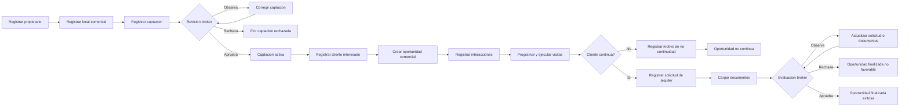

# Flujo Comercial Con Oportunidad

Este documento explica el flujo completo de ControlLocal desde la captacion de un local hasta el cierre o la no continuidad de una oportunidad.

La entidad central es `OportunidadComercial`, porque conserva el seguimiento aunque el cliente no llegue a presentar una solicitud formal.

## Idea Principal

```text
Propietario -> Local -> Captacion -> Oportunidad -> Interacciones / Visitas
                                      |
                                      | si continua
                                      v
                                Solicitud -> Documentos -> Evaluacion -> Cierre
```

## Flujo Operativo

1. El agente registra el propietario.
2. El agente registra el local comercial vinculado al propietario.
3. El agente registra una captacion del local.
4. El broker administrador o broker supervisor revisa la captacion.
5. Si el broker observa, el agente corrige y vuelve a revision.
6. Si el broker rechaza, termina el proceso de captacion.
7. Si el broker aprueba, la captacion queda activa.
8. El agente registra un cliente interesado.
9. El agente crea una oportunidad comercial con cliente, captacion y agente.
10. El agente registra interacciones comerciales.
11. El agente programa y actualiza visitas.
12. Si el cliente no continua, se registra motivo de no continuidad.
13. Si el cliente continua, se registra solicitud de alquiler.
14. El agente carga documentacion asociada.
15. El broker evalua la solicitud.
16. Si el broker observa, el agente actualiza solicitud o documentos y reenvia.
17. Si el broker aprueba, la oportunidad finaliza como exitosa.
18. Si el broker rechaza, la oportunidad finaliza como no favorable.

## Diagrama Logico



## Estados Clave

### Captacion

| Estado | Codigo | Significado operativo |
| --- | --- | --- |
| `PENDIENTE_REVISION` | `P` | El agente envio la captacion y espera decision del broker. |
| `OBSERVADA` | `O` | El broker pidio correcciones. |
| `RECHAZADA` | `R` | La captacion no puede continuar. |
| `ACTIVA` | `A` | El local puede comercializarse. |
| `CERRADA` | `C` | La captacion se cerro por decision operativa. |
| `VENCIDA` | `V` | La vigencia termino. |

### Oportunidad Comercial

| Estado | Codigo | Significado operativo |
| --- | --- | --- |
| `ABIERTA` | `A` | Hay interes activo. |
| `SOLICITUD_CREADA` | `S` | El cliente paso a solicitud formal. |
| `NO_CONTINUA` | `N` | El cliente abandono o fue descartado. |
| `FINALIZADA_EXITOSA` | `F` | La operacion llego a cierre favorable. |
| `FINALIZADA_NO_FAVORABLE` | `X` | La solicitud o cierre no fue favorable. |

### Visita

| Estado | Codigo | Significado operativo |
| --- | --- | --- |
| `PROGRAMADA` | `P` | Visita agendada. |
| `REPROGRAMADA` | `G` | Visita movida a nueva fecha u hora. |
| `CANCELADA` | `C` | Visita cancelada antes de realizarse. |
| `NO_REALIZADA` | `N` | La visita no ocurrio. |
| `REALIZADA` | `R` | La visita se ejecuto y puede tener resultado. |

### Solicitud De Alquiler

| Estado | Codigo | Significado operativo |
| --- | --- | --- |
| `REGISTRADA` | `G` | La solicitud fue creada por el agente. |
| `EN_REVISION` | `E` | La solicitud fue enviada al broker. |
| `OBSERVADA` | `O` | Requiere ajustes o documentos adicionales. |
| `APROBADA` | `A` | El broker aprueba avanzar. |
| `RECHAZADA` | `R` | El broker rechaza la solicitud. |
| `DESISTIDA` | `D` | El cliente ya no continua con la solicitud. |

## Sustento De Las Entidades En El Flujo

| Entidad | Por que aparece en este punto |
| --- | --- |
| `Propietario` | Sin titular no hay autorizacion clara para comercializar el local. |
| `LocalComercial` | Es el bien que se oferta y debe tener datos comerciales suficientes. |
| `Captacion` | Formaliza que el agente puede trabajar ese local. |
| `Broker` | Revisa y controla calidad antes de activar operaciones. |
| `ClienteInteresado` | Representa la demanda. |
| `OportunidadComercial` | Une demanda, oferta y agente en un caso trazable. |
| `InteraccionComercial` | Registra cada contacto importante. |
| `Visita` | Mide interes real al ver el local. |
| `MotivoNoContinuidad` | Evita perder la razon de abandono o descarte. |
| `SolicitudAlquiler` | Formaliza propuesta y condiciones. |
| `DocumentoSolicitud` | Sustenta identidad, capacidad y garantias. |
| `EvaluacionSolicitud` | Registra decision del broker. |
| `ContratoAlquiler` | Representa cierre contractual favorable. |
| `ComisionLiquidacion` | Permite controlar cobranza de la comision. |
| `HistorialEstado` | Reconstruye cambios importantes. |

## Decisiones De Negocio

### Captacion

La captacion no debe pasar directamente a activa sin revision, porque el broker valida que el local, la vigencia, la comision y las condiciones comerciales sean aceptables.

### Oportunidad

La oportunidad nace antes de la solicitud para que el sistema no pierda informacion de clientes que preguntan, visitan o negocian, aunque finalmente no alquilen.

### No Continuidad

El motivo de no continuidad debe registrarse cuando el cliente no sigue. Esto permite medir si se pierden operaciones por precio, ubicacion, condiciones, falta de respuesta u otras razones.

### Solicitud

La solicitud representa un cambio de intencion: el cliente ya no solo pregunta, sino que propone condiciones de alquiler y presenta sustento.

### Evaluacion

La evaluacion la hace el broker para mantener separacion entre quien registra la operacion y quien decide si avanza.

## Prueba Manual Recomendada

### Camino Favorable

1. Iniciar sesion como agente.
2. Crear propietario.
3. Crear local.
4. Crear captacion.
5. Iniciar sesion como broker.
6. Aprobar captacion.
7. Iniciar sesion como agente.
8. Crear cliente interesado.
9. Crear oportunidad.
10. Registrar interaccion.
11. Programar visita.
12. Registrar resultado `INTERESADO`.
13. Crear solicitud.
14. Cargar documentos.
15. Iniciar sesion como broker.
16. Aprobar solicitud.
17. Verificar oportunidad finalizada exitosa.

### Camino No Favorable

1. Crear o abrir oportunidad activa.
2. Registrar visita.
3. Registrar resultado `NO_INTERESADO` o `DESCARTADO`.
4. Elegir motivo de no continuidad.
5. Verificar que la oportunidad quede `NO_CONTINUA`.

### Camino Con Observacion

1. Crear captacion.
2. Como broker, observar captacion.
3. Como agente, corregir captacion.
4. Como broker, aprobar.
5. Crear solicitud.
6. Como broker, observar solicitud.
7. Como agente, actualizar solicitud o documentos.
8. Reenviar a evaluacion.

## Prompt Para Recrear La Imagen Del Flujo

```text
Genera un diagrama horizontal de flujo de proceso comercial para el sistema ControlLocal.
Usa estilo limpio, profesional y academico, con cajas rectangulares para actividades,
rombos para decisiones y colores suaves: azul claro para actividades operativas,
verde para revisiones o aprobaciones, naranja para ajustes u observaciones, rojo suave
para rechazos o no continuidad, y verde intenso para cierre exitoso.

El flujo debe ir de izquierda a derecha y contener:

Inicio
-> Registro de propietario
-> Registro de local comercial
-> Registro de captacion por agente inmobiliario
-> Revision de captacion por broker administrador o broker supervisor

Desde Revision de captacion salen tres caminos:
1. Aprueba -> Captacion activa
2. Solicita ajustes -> Correccion de captacion por agente -> vuelve a revision
3. Rechaza -> Fin del proceso de captacion

Desde Captacion activa:
-> Registro de cliente interesado
-> Creacion de oportunidad comercial
-> Registro de interacciones
-> Programacion y ejecucion de visitas
-> Decision: El cliente continua?

Si No:
-> Registro de motivo de no continuidad
-> Oportunidad no continua
-> Fin

Si Si:
-> Registro de solicitud de alquiler
-> Carga de documentos
-> Evaluacion de solicitud por broker

Desde Evaluacion salen tres caminos:
1. Aprueba -> Cierre exitoso de oportunidad -> Fin
2. Rechaza -> Cierre no favorable -> Fin
3. Observa -> Actualizacion de solicitud o documentos -> vuelve a evaluacion

Agregar nota debajo de Creacion de oportunidad comercial:
La oportunidad conserva trazabilidad aunque no exista solicitud formal.
```
